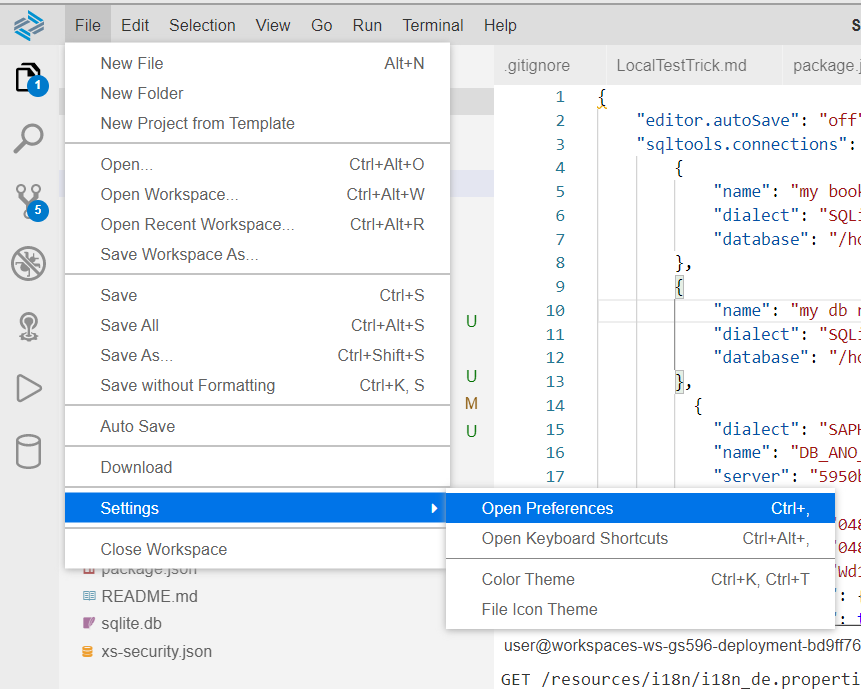
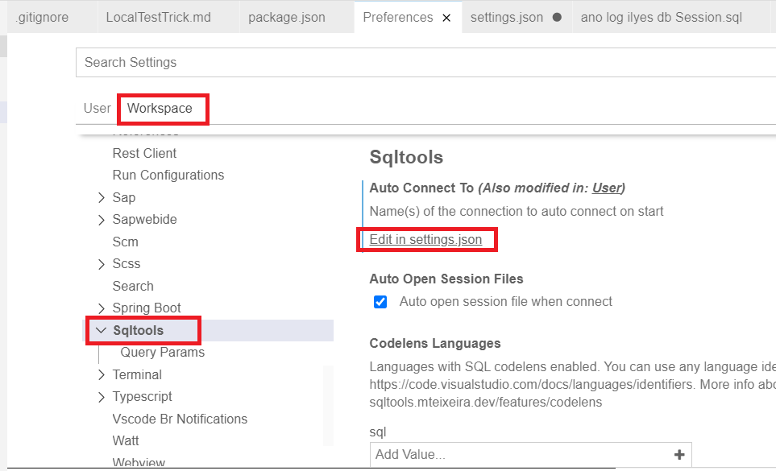
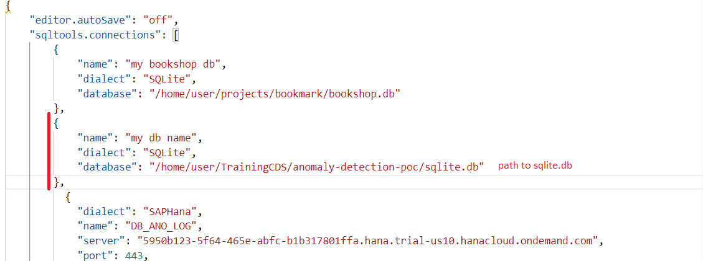
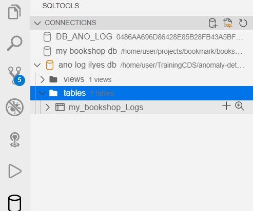
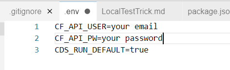
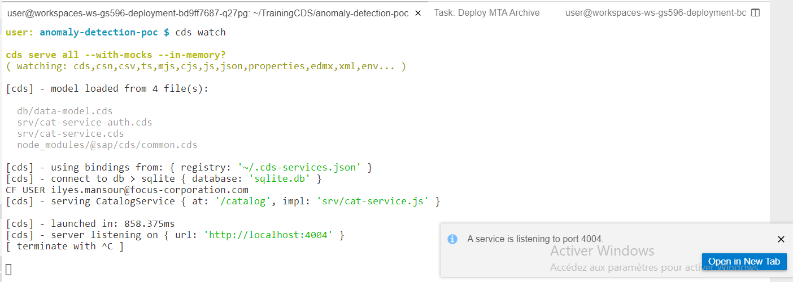
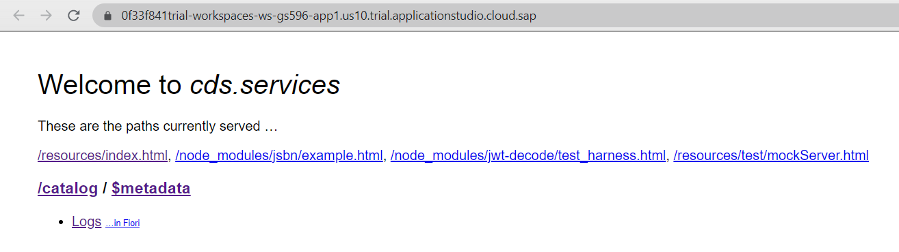
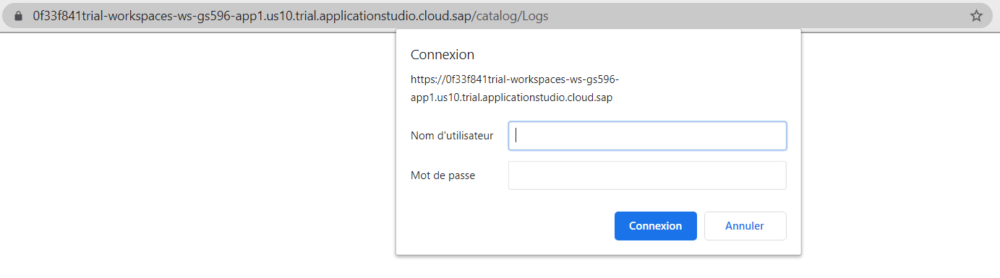
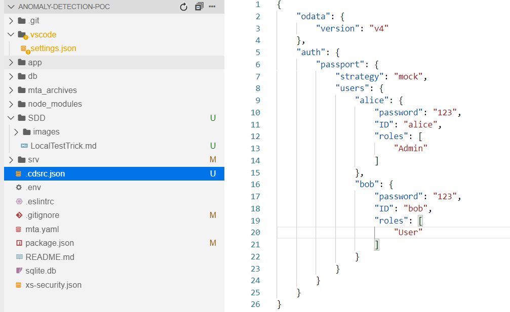

#  ANOMALY DETECTION - LOCAL TEST

The main goal is allow local tests by using sqlite db and the default CDS server.js to display changes instantly.

## SQLITE DB CONNECTION

#### 1- Generate the sqlite.db 

Run the following command : cds deploy --to sqlite 

P.S. this will update the package.json file -> so revert those changes.

#### 1- Add connection to sqlite

Like what was done with HANA connection, we will add sqlite connection section in the connection in setting.json 

* file > settings > open Preferences

* open setting.json under workspace

* add connection pool

now we are able to connect to our local db

## Local test

#### 1- Envirement variable set

create a .env file and add your credentials to be able to get logs from kibana later

P.S. CDS_RUN_DEFAULT=true will allow us to run the default server.js and use cds watch later

#### 2- runnig the application

* in the root folder run the commande: npm install

* then run the commande: cds watch

the port is exposed, you can run open and run the app

when testings the logs you have to enter another credentials (not yours) that belongs to fake users allowed (have different scopes and roles) to access services.

you can find those credentials in the .cdsrc.json file (e.g user alice and pw 123)

